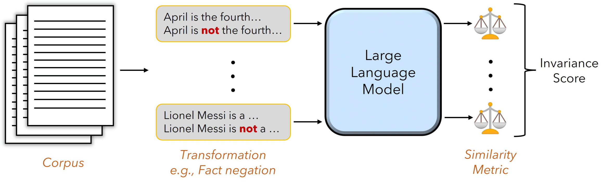

# Bring Your Own Data! Self-Supervised Evaluation for Large Language Models

The official code for Bring Your Own Data! Self-Supervised Evaluation for Large Language Models.
If you have any questions, feel free to email (<njain17@umd.edu>).




## About
To complement conventional evaluation, we propose a framework for _self-supervised model evaluation_. In this framework, metrics are defined as invariances and sensitivities that can be checked in a self-supervised fashion using interventions based only on the model in question rather than external labels. Self-supervised evaluation pipelines are _dataset-agnostic_, and so they can be utilized over larger corpora of evaluation data than conventional metrics, or even directly in production systems to monitor day-to-day performance. In this work, we develop this framework, discuss desiderata for such metrics, and provide a number of case studies for self-supervised metrics: knownledge capability, toxicity detection, long-range (context), word-order, and tokenization sensitivities. By developing these new metrics, we hope to provide a more comprehensive and nuanced understanding of the strengths and limitations of LLMs.

## Installation

You can run `pip install byod` to directly install our package. Or, install directly from source via `pip install git+https://github.com/neelsjain/BYOD/`.

## Dependencies

* transformers==4.28.1
* scipy==1.10.1
* torch==2.0.0
* datasets==2.11.0
* nltk==3.8.1
* apache_beam==2.48.0

Python 3.8 or higher is recommended

## Usage

See `run_model.sh` for examples on how to evaluate a model. We provide scripts to run all huggingface models against metrics computed on wikipedia data, as an example. These are named `run_[metric].py`.

Note that only models are huggingface are currently supported.


You can also use the metrics directly, given your own `model`, `tokenizer`, and `dataset`, like so
```
import BYOD

long_range_sensitivity = BYOD.lrs_metric(model, data, tokenizer)
negation_knowledge = BYOD.negation_metric(model, data, tokenizer)
tokenization_robustness = BYOD.tokenization_metric(model, data, tokenizer)
toxicity_proxy = BYOD.toxicity_metric(model, data, tokenizer)
word_order_sensitivity = BYOD.word_order_metric(model, data, tokenizer)
```


## Suggestions and Pull Requests are welcome!
Everything can be better! If you have suggestions on improving the codebase or the invariance/sensitivity test. Feel free to reach out!
